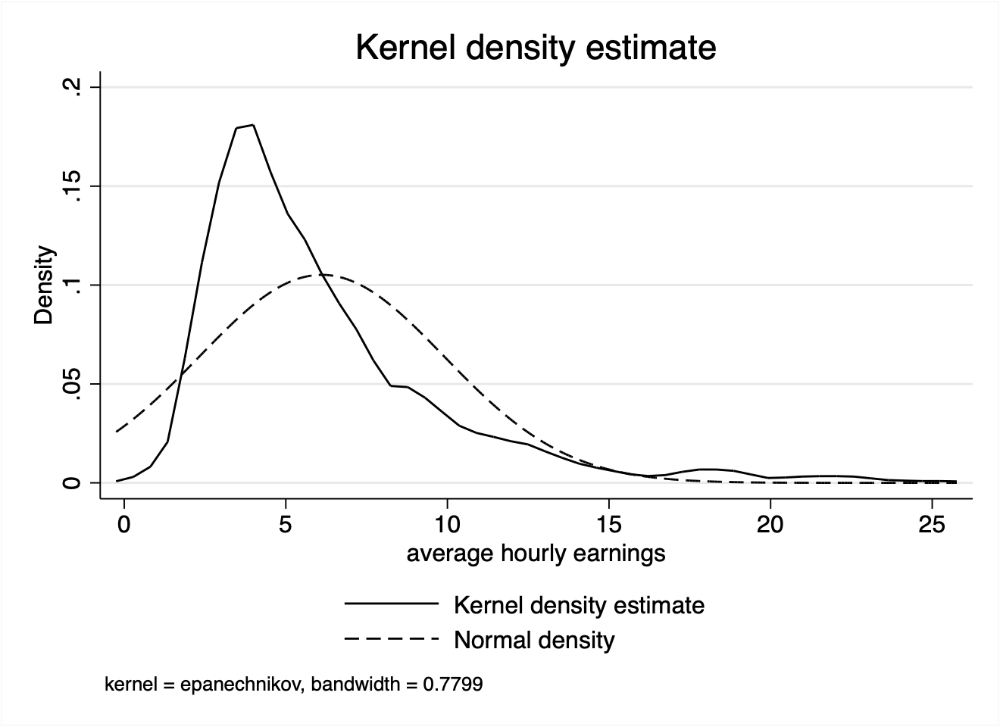

# 1. Exploratory data analysis

{{1}}

We have to clean observations with *missing* data. In our sample we **drop** {{.2}} observations.

{{3}}

{width=35%}

# 2. Regression analysis

We will now estimate the following model: $a^2+b^2=c^2$.

{{4}}

The return to education is about {{.5}} %. One concludes that (...)

According to @cardoso2008, (...)

## References
---
